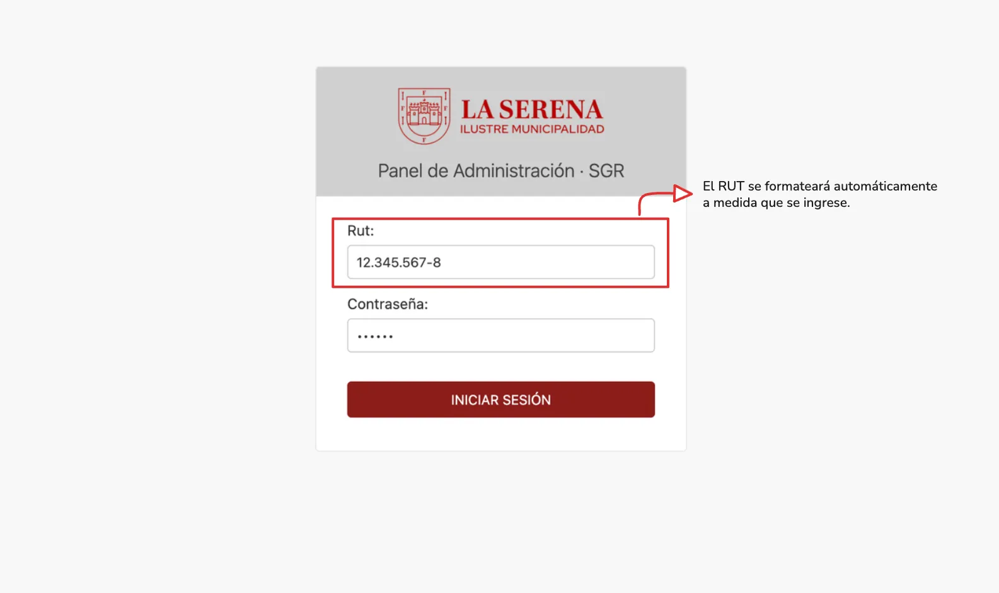
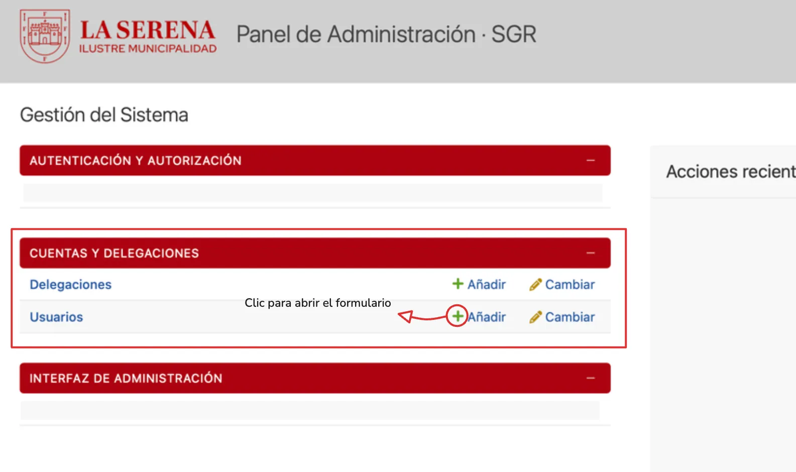

El usuario **administrador** podrá registrar nuevos usuarios en el sistema mediante el formulario de creación desde el panel administrativo. Para ello, debe realizar lo siguiente:

- Iniciar sesión en el login administrativo.
- Abrir la sección de cuentas de usuarios.

- 

- 

Para crear un usuario, el administrador deberá:

1. Ingresar el **RUT** del usuario.
2. Ingresar sus **nombres y apellidos**.
3. Registrar su **correo electrónico** y **teléfono de contacto**.
4. Seleccionar el **cargo** que desempeñará dentro del sistema.
5. Seleccionar la **delegación** a la que pertenecerá el usuario.
6. Asignar uno o más **roles**, de acuerdo con las funciones que tendrá dentro del sistema.
7. Definir el **estado** inicial de la cuenta.
8. Establecer la **contraseña de acceso** y confirmarla.
9. Seleccionar **Crear usuario** para registrar la cuenta.

<iframe src="https://mcherrera911.notion.site/ebd//3da349bf9dae8071aa27d05e1b179ce6" width="100%" height="1450" frameborder="0" allowfullscreen />

Una vez creado, el usuario quedará asociado a la **delegación y roles definidos por el administrador**, determinando de esta forma las funcionalidades y permisos que tendrá disponibles dentro del sistema.
