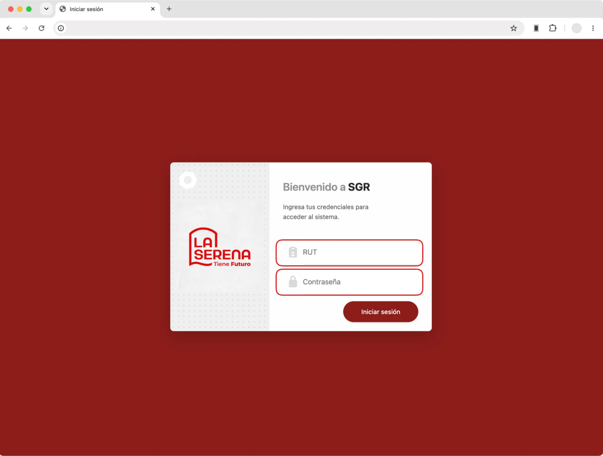

Los usuarios podrán acceder al sistema mediante el formulario de inicio de sesión disponible en: `/accounts/login/`

Para ello, el usuario deberá ingresar sus credenciales de acceso correspondientes.

*  __Login usuarios__

Para iniciar sesión, el usuario deberá:

1. Ingresar su **RUT**.

2. Ingresar su **contraseña de acceso**.

3. Seleccionar **Iniciar sesión** para acceder al sistema.

A medida que se ingrese el **RUT**, este se formateará automáticamente de manera correcta.

Una vez validadas las credenciales, el usuario podrá acceder al sistema de acuerdo con los **roles y permisos asignados a su cuenta**, disponiendo de las funcionalidades correspondientes a su perfil.
